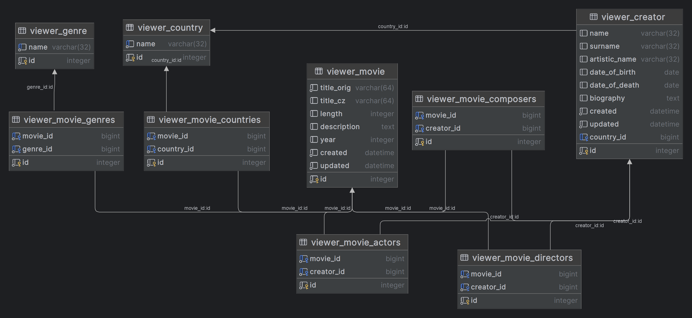

# Backend technologies

## Sylabus
### Úterý, 27. května · 17:30–21:00
- Prošli jsme slidy 1-15 
- Úvod
- Vytvoření projektu `hollymovies`
- Vytvoření superuser
- Vytvoření aplikace `viewer`
- .env
- Git repozitář (.gitignore)
- readme.md
- Domácí úkol: definovat add2 funkci pro sčítání pomocí kódování URL

### Středa, 28. května · 17:30–21:00
- Prošli jsme slidy 16-27
- ORM
- Model
- migrace
- shell
- viewer.models.py
  - Genre
  - Country
  - Creator
- Domácí úkol: definovat model Movie

### Pátek, 30. května · 17:30–21:00
- Prošli jsme slidy 28-36
- viewer.models.py
  - Movie 
- Panel administrátora
- Vkládání dat přes panel administrátora
- DUMP/LOAD databáze (v utf8)
- Dotazy (Queries)

### Pondělí, 2. června · 17:30–21:00
- Prošli jsme slidy 37-50
- Manipulace s daty
  - Create - vytvoření
  - Update - aktualizace
  - Delete - mazání
- Templates 
  - včetně inheritance (dědičnosti)
  - včetně include (vkládání)
- Feature 1 - seznam filmů
- Feature 2 - detail filmu

### Úterý, 3. června · 17:30–21:00
- Prošli jsme slidy 51-55
- Class-based view
  - View
  - TemplateView
  - ListView
  - DetailView
- Feature 4 - seznam tvůrců
- Feature 5 - detail tvůrce
- Feature 6 - země (seznam + detail)
- Feature 7 - žánry (seznam + detail)

### Čtvrtek, 5. června · 17:30–21:00
### Pátek, 13. června · 17:30–21:00
### Pondělí, 16. června · 17:30–21:00
### Středa, 25. června · 17:30–21:00
### Pondělí, 30. června · 17:30–20:30
### Úterý, 1. července · 17:30–21:00
### Čtvrtek, 3. července · 17:30–21:30

## Django
### Instalace
```bash
pip install django
pip freeze > requirements.txt
django-admin startproject <nazev_projektu> .
```

### Struktura projektu
- `hollymovies` - složka projektu (obsahuje informace o celém projektu)
  - `__init__.py` - je zde jen proto, aby daná složka byla package
  - `asgi.py` - nebudeme potřebovat
  - `settings.py` - nastavení projektu
  - `urls.py` - zde jsou nastavené url adresy
  - `wsgi.py` - nebudeme potřebovat
- `manage.py` - hlavní skript pro práci s projektem (souštění serveru, testů, migrací,...)

### Spuštění serveru
```bash
python manage.py runserver
```

### .env
Slouží k ukládání citlivých informací (SECRET_KEY, hesla, přístupové údaje,...).

#### Instalace
```bash
pip install python-dotenv
pip freeze > requirements.txt
```

Vytvoříme soubour s názvem `.env` v kořenovém adresáři projektu.

Do souboru `settings.py` vložíme:
```python
from dotenv import load_dotenv
load_dotenv()
SECRET_KEY = os.getenv('SECRET_KEY', default='django-insecure-)si+fpno3#)=7__vx-4%ni^&n1wvaz9bju1e+s8*i!e9qt!@f)')
```

### .gitignore
Správný projekt má nastavení pro ingorované soubory v git repozitáři v souboru `.gitignore`.
```git
/.idea
*.pyc
/db.sqlite3
/.env
```

### Aplikace
#### Vytvoření
```bash
python manage.py startapp <název_aplikace>
```

#### Struktura aplikace
- `viewer` - složka aplikace
  - `migrations` - složka obsahující migrační skripty
  - `__init__.py` - je tu zde jen proto, aby daná složka byla package
  - `admin.py` - nastavení administrační stránky
  - `apps.py` - nastavení aplikace - nebudeme upravovat
  - `models.py` - zde bude definice modelů (databáze)
  - `tests.py` - zde budou testy
  - `views.py` - zde budou views (funkcionalita)

#### Registrace aplikace
Do souboru `settings.py` musíme novou aplikaci zaregistrovat do seznamu 
`INSTALLED_APPS`:
```python
INSTALLED_APPS = [
    'django.contrib.admin',
    'django.contrib.auth',
    'django.contrib.contenttypes',
    'django.contrib.sessions',
    'django.contrib.messages',
    'django.contrib.staticfiles',

    'viewer',
]
```

## Publikování projektu na GitHub
- V PyCharm: Main menu -> Git -> GitHub -> Share Project on GitHub
- můžete změnit název repozitáře
- Na GitHub
  - nasdílet kód repozitáře
  - Settings -> Colloborators -> Add people 

### Vytvoření superuživatele
```bash
python manage.py createsuperuser
```

# Projekt Hollymovies
## Funkcionalita
- [x] 1 seznam filmů (abecedně)
- [x] 2 detail filmu 
  - [x] originální název
  - [x] český název
  - [x] žánry
  - [x] země
  - [x] režiséři
  - [x] herci
  - [x] skladatel hudby
  - [x] délka
  - [x] rok
  - [x] popis
- [ ] 2.1 další informace o filmu 
  - [ ] hodnocení
  - [ ] ocenění
  - [ ] obrázky
  - [ ] návštěvnost v kinech (https://kinomaniak.cz/)
  - [ ] VOD (https://www.kinobox.cz/)
  - [ ] trailer
  - [ ] kde se odehrává film
- [ ] 3 filtrování filmů
  - [ ] podle žánru 
  - [ ] podle roku
  - [ ] podle hodnocení
  - [ ] podle herce
- [x] 4 seznam herců
- [x] 5 detail tvůrce
  - [x] jméno
  - [x] příjmení
  - [x] umělecké jméno
  - [x] země
  - [x] datum narození
  - [x] datum úmrtí
  - [x] filmy, ve kterých hrál
  - [x] filmy, které režíroval
  - [x] filmy, které komponoval
  - [x] biografie
- [ ] 5.1 další informace o tvůrci 
  - [ ] ocenění
  - [ ] obrázky
- [x] 6 země 
  - [x] 6.1 seznam
  - [x] 6.2 detail
- [x] 7 žánr 
  - [x] 7.1 seznam
  - [x] 7.2 detail
- [ ] 8 Přidávání
  - [ ] 8.1 Žánr
  - [ ] 8.2 Země
  - [ ] 8.3 Tvůrce
  - [ ] 8.4 Film
- [ ] 9 Editace
  - [ ] 9.1 Žánr
  - [ ] 9.2 Země
  - [ ] 9.3 Tvůrce
  - [ ] 9.4 Film
- [ ] 10 Mazání
  - [ ] 10.1 Žánr
  - [ ] 10.2 Země
  - [ ] 10.3 Tvůrce
  - [ ] 10.4 Film

## Databáze

- [x] Genre
  - [x] name (String)
- [x] Country
  - [x] name (String) 
- [x] Creator
  - [x] name (String)
  - [x] surname (String)
  - [x] artistic_name (String)
  - [x] date_of_birth (Date)
  - [x] date_of_death (Date)
  - [x] country (FK -> Country)
  - [x] biography (String)
  - [x] acting (n:m -> Movie) - related_name z modelu Movie
  - [x] directing (n:m -> Movie) - related_name z modelu Movie
  - [x] composing (n:m -> Movie) - related_name z modelu Movie
- [x] Movie
  - [x] title_orig (String)
  - [x] title_cz (String)
  - [x] genres (n:m -> Genre) # ManyToManyField(Genre, blank=True, related_name='movies')
  - [x] directors (n:m -> Creator)
  - [x] actors (n:m -> Creator)
  - [x] composers (n:m -> Creator)
  - [x] length (Integer) (minuty)
  - [x] description (String)
  - [x] year (Integer)
  - [x] countries (n:m -> Country)

### DUMP/LOAD databáze
```bash
pip install django-dump-load-utf8
```

Přidáme `'django_dump_load_utf8',` do seznamu nainstalovaných aplikací
`INSTALLED_APPS` v souboru `settings.py`.

#### DUMP
```bash
python manage.py dumpdatautf8 <nazev_aplikace> --output <cesta_k_souboru>
```

#### LOAD
```bash
python manage.py loaddatautf8 <cesta_k_souboru>
```

### Dotazy (Queries)
#### Import modelů
`from viewer.models import *`

#### .all()
Vrací kolekci všech nalezených záznamů z tabulky:

`Movie.objects.all()`

#### .get()
Vrátí jeden nalezený záznam (první, který splňuje podmínku):

`Movie.objects.get(id=1)`

`Genre.objects.get(name='Drama')`

#### .filter()
Vrací kolekci záznamů, které splňují podmínky:

`Movie.objects.filter(id=1)`

`Movie.objects.filter(title_orig="The Green Mile")`

`Movie.objects.filter(year=1994)`

`Creator.objects.filter(date_of_birth__year=1955)`

`Creator.objects.filter(date_of_birth__year__gt=1955)` -- `__gt` => "větší než" (greater then)

`Creator.objects.filter(date_of_birth__year__gte=1955)` -- `__gte` => "větší rovno" (greater then equal)

`Creator.objects.filter(date_of_birth__year__lt=1955)` -- `__lt` => "menší než" (less then)

`Creator.objects.filter(date_of_birth__year__lte=1955)` -- `__lte` => "menší rovno" (less then equal)

Výpis všech filmů, které mají žánr "Drama":

`drama = Genre.objects.get(name='Drama')`

`Movie.objects.filter(genres=drama)`

nebo:

`Movie.objects.filter(genres=Genre.objects.get(name='Drama'))`

nebo:

`Movie.objects.filter(genres__name='Drama')`

nebo:

`drama = Genre.objects.get(name='Drama')`

`drama.movies.all()`

Herci filmu Forrest Gump:

`movie = Movie.objects.get(title_orig='Forrest Gump')`

`movie.actors.all()`

Všechny filmy, ve kterých hrál Tom Hanks:

`tom = Creator.objects.get(name='Tom', surname='Hanks')`

`tom.acting.all()`

Všichni tvůrci z Francie:

`france = Country.objects.get(name='Francie')`

`france.creators.all()`

Všechny filmy, které obsahují v názvu "Gump":

`Movie.objects.filter(title_orig__contains='Gump')`

Vícenásobné filtry:

`Movie.objects.filter(genres__name='Drama', year=1999)` -- více podmínek, defaultně AND

`Movie.objects.filter(genres__name='Drama').filter(year=1999)` -- metody lze řetězit za sebe

"in":

`Movie.objects.filter(title_orig__in=['Forrest Gump', 'The Green Mile'])`

#### .exclude()
`Movie.objects.exclude(title_orig__in=['Forrest Gump', 'The Green Mile'])`

#### .exists()

`Movie.objects.filter(year=1994).exists()` -- zda existuje nějaký film z roku 1994

#### .count()

`Movie.objects.filter(year=1994).count()` -- počet filmů z roku 1994

#### .order_by()

`Movie.objects.all()`

`Movie.objects.all().order_by('year')`

`Movie.objects.all().order_by('-year')`

#### Agregační funkce:

`from django.db.models import Avg, Min, Max`

`Movie.objects.aggregate(Avg('length'))` -- průměrná délka filmů

`Movie.objects.aggregate(Avg('length'), Min('length'), Max('length'))`

#### group_by:

`from django.db.models import Count`

`Movie.objects.values('genres').annotate(count=Count('genres'))`

### Manipulace s daty
#### .create:

`Country.objects.create(name="Rakousko")`

nebo:

`italy = Country(name="Itálie")`

`italy.save()`

#### .update()

`Movie.objects.filter(released__year=2000).update(rating=5)`

nebo:

`forrest = Movie.objects.get(title_orig='Forrest Gump')`

`forrest.length = 152`

`forrest.save()`

#### .delete()

`Genre.objects.get(name='Horror').delete()`